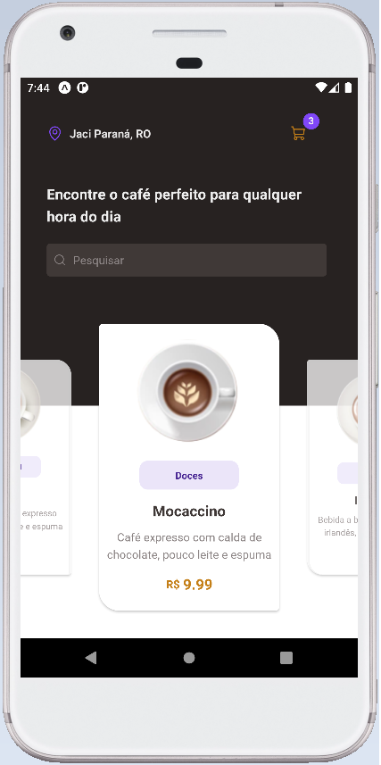

# coffeedelivery

# Desafio Ignite Rocketseat -  Coffeedelivery

### Sobre:
Uma aplicação mobile em React Native de E-commerce com animações muito interessantes, que contém as seguintes funcionalidades:

### Demo:
<h1 align="center">
  
</h1>

    

### Funcionalidades:
- Adicionar produtos no carrinho
- Remover estes itens atraves de gestos
- Gerenciamento de produtos
- Listagem de produtos com busca e filtros
- Envio de múltiplas imagens
- Selecionar os tipos de café atraves de botões interativos

E outras coisinhas.

### Ferramentas, Técnicas e Bibliotecas:
Foram utilizadas as seguintes temas:

- DataBase
- Upload de imagens
- Listagem
- Hooks
- Native Base
- React Navigation
- LocalStorage
- Typescript

</h1>

  <small> Carlos Henrique Farias Júnior - 2023</small>

